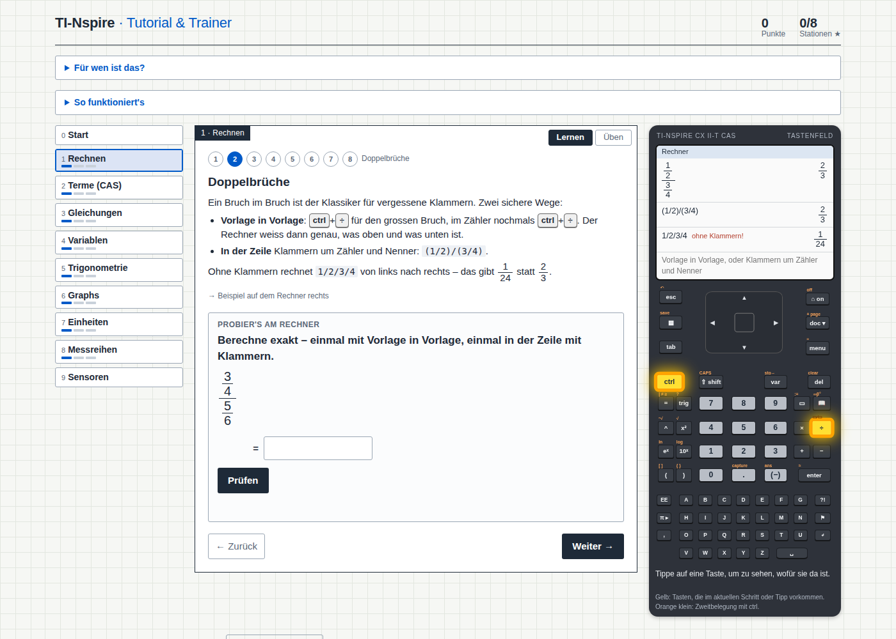

# tbz-tools

Eigenständige HTML-Übungswerkzeuge für den Unterricht (Technische
Berufsschule Zürich). Wird über GitHub Pages ausgeliefert; die Quelle
der Werkzeuge liegt im (privaten) Unterrichts-Repo `tbz` und wird von
dort hierher kopiert.

- `projektionsmethode-trainer.html` – TZ Kap. 2, sechs Ansichten nach
  Projektionsmethode 1 zuordnen (drehbares 3D-Modell).
- `skript-aufgaben.html` – TZ Kap. 2.3, die sechs Werkstücke der
  Skript-Aufgaben S. 18–21 als 3D-Modell; Ansichten aufdecken oder als
  Quiz zuordnen (vom Trainer aus verlinkt).
- `konstante-beschleunigung-animation.html` – Physik Kap. 2, Bewegung
  mit konstanter Beschleunigung: Fahrzeug, Zerlegung
  x = x₀ + v₀·t + ½·a·t² und die drei Diagramme x–t, v–t, a–t.
- `schiefe-ebene-simulation.html` – Physik Versuch 1, Wagen auf der
  schiefen Ebene ohne Reibung, Höhe einstellbar; Diagramme s–t, v–t,
  a–t und Messreihe a(h) bzw. a(α).
- `ti-nspire.html` – Physik/Algebra Kap. 0, TI-Nspire CX II-T CAS:
  Tutorial und Trainer in zehn Stationen (Lernen mit Tastenfeld und
  Bildschirm-Nachbau, Üben in drei Stufen mit Aufgaben aus den Skripten).

## TI-Nspire – Tutorial & Trainer

**<https://nunigan.github.io/tbz-tools/ti-nspire.html>** – den TI-Nspire
CX II-T CAS Schritt für Schritt lernen (Tastenfeld und Bildschirm-Nachbau,
Tasten leuchten auf) und mit dem Gerät daneben üben (drei Stufen pro
Station, Aufgaben mit Zufallszahlen und Rückmeldung zu typischen Fehlern).
Stationen: Start, Rechnen, Terme (CAS), Gleichungen, Variablen,
Trigonometrie, Graphs, Einheiten, Messreihen, Sensoren. Für Berufsschule,
BMS und Gymnasium, erstes Jahr; deutsches Gerätemenü. Eine HTML-Datei,
keine Abhängigkeiten, läuft offline; Fortschritt bleibt im Browser.

**Lizenz:** `ti-nspire.html` steht unter
[CC BY-SA 4.0](https://creativecommons.org/licenses/by-sa/4.0/deed.de)
(M. Schmid, Technische Berufsschule Zürich) – frei nutzen, anpassen und
weitergeben, mit Namensnennung und unter gleicher Lizenz. Die übrigen
Werkzeuge in diesem Repo sind vorerst nur für den Unterrichtsgebrauch
freigegeben.

**Mitmachen:** Stimmt ein Tastenweg auf deinem Gerät nicht, fehlt eine
Aufgabe, ist etwas unklar? Bitte ein
[Issue](https://github.com/Nunigan/tbz-tools/issues) eröffnen. Alle
Tastenwege sind gegen das TI-Handbuch geprüft; einzelne Menünummern noch
nicht am Gerät.
